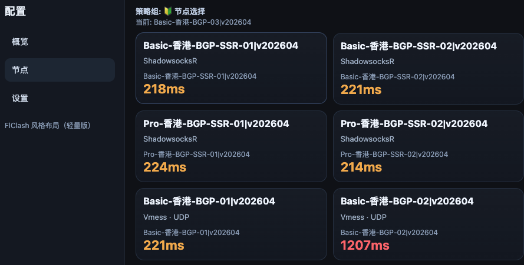

# mihomo-aio

`mihomo-aio` 是一个以 [MetaCubeX/mihomo](https://github.com/MetaCubeX/mihomo) 为核心、工程组织参考 `clash-aio` 的 Docker Compose 项目。

## UI 参考

Web 管理页面的交互与信息架构参考了 [FlClash](https://github.com/chen08209/FlClash) 的设计思路，并在 `dashboard/` 下以轻量原生前端实现（不引入 Flutter）。

节点页效果示例：



## 功能概览

- 核心固定为 `mihomo`
- 三容器编排：`subconverter + mihomo-core + dashboard`
- `.env` 统一管理端口、订阅、密钥等关键配置
- 保留脚本化控制能力：延迟查询、节点切换、订阅热重载
- 默认提供健康检查与冒烟测试脚本

## 前置条件

- Docker Engine
- Docker Compose Plugin（支持 `docker compose`）
- 宿主机端口无冲突（见下方端口映射）

## 快速开始

```bash
cp .env.example .env
# 编辑 .env（至少填写 RAW_SUB_URL）
./scripts/up.sh
```

`up.sh` 行为：

- 启动容器栈
- 打印 Web 管理地址
- 启动完成后直接回到宿主机终端（不进入容器）

## 环境变量说明

关键变量见 [`.env.example`](.env.example)。

重点项：

- `RAW_SUB_URL`：订阅地址（建议必填）
- `ALL_PROXY_PORT`：宿主机代理端口
- `CONTROL_PANEL_PORT`：宿主机 Web 管理端口
- `EXTERNAL_CONTROLLER_PORT`：external-controller 端口
- `SECRET`：API 认证密钥（生产请勿使用弱值）

## 端口映射

默认映射如下（宿主机 `<->` 容器）：

- Proxy: `17890 <-> 7890`
- API: `19090 <-> 19090`
- Dashboard: `19091 <-> 80`
- Subconverter: `25501 <-> 25500`

## 常用脚本

- 启动容器：`./scripts/up.sh`
- 关闭容器：`./scripts/down.sh`
- 进入核心容器：`./scripts/shell.sh`
- 延迟查询：`./scripts/list-proxies-latency.sh [limit]`
- 按序号切换节点：`./scripts/select-proxy-by-index.sh [limit]`
- 订阅热重载：`./scripts/subscription-hot-reload.sh`
- 健康检查：`./scripts/health-check.sh`
- 冒烟测试：`./scripts/smoke-test.sh`
- API 调试：`./scripts/debug-api.sh`

## 测试与排障

```bash
# 基础健康检查
./scripts/health-check.sh

# 启动后冒烟
./scripts/smoke-test.sh

# API 调试（容器状态、接口、关键配置）
./scripts/debug-api.sh
```

## 目录

- `Dockerfile` / `entrypoint.sh`：mihomo 容器构建与启动
- `docker-compose.yaml`：三服务编排
- `dashboard/`：Web 管理面
- `scripts/`：运维与控制脚本
- `DEPLOYMENT.md`：部署与排障补充文档


## 许可证

本项目采用 `Apache-2.0` 许可证，允许商用。

再分发或二次发布时，请保留以下文件与声明：

- `LICENSE`
- `NOTICE`
- 源代码中的版权与归属说明

详细条款见 [`LICENSE`](LICENSE) 与 [`NOTICE`](NOTICE)。
